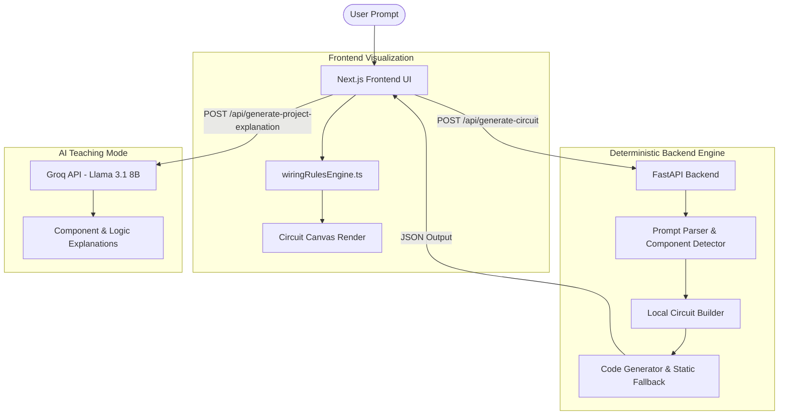

# CircuitMentor
## Official Architecture & Workflow Documentation

---

### 1. Executive Summary
**CircuitMentor** is an AI-enhanced electronics learning platform designed to take students from an abstract idea (e.g., "Make a motion-activated alarm") to a physical, working circuit. 

Initially relying heavily on LLMs (Groq/Llama-3) for circuit netlist generation, the system suffered from rate limits, unpredictable hallucinations, and high latency. We successfully pivoted the core architecture: **circuit generation is now 100% deterministic, offline, and instant**, while AI is strictly reserved for teaching, explaining code, and answering student questions.

---

### 2. System Architecture
The platform is split into a **React/Next.js Frontend** and a **Python FastAPI Backend**.

---

### 3. Core Workflows

#### A. Circuit & Code Generation (Deterministic)
When a user types a prompt like *"soil moisture sensor with buzzer"*:
1. **Prompt Parsing (`local_circuit_engine.py`)**: The backend converts the text into a `concept` block (Inputs, Logic, Outputs) using advanced keyword mapping (`COMPONENT_KEYWORDS`).
2. **Circuit Building**: The engine maps these components to a local `PIN_MAP` (e.g., Soil Sensor -> A2, Buzzer -> Pin 8), guaranteeing safe, predictable pin assignments.
3. **EIL Gatekeeper Bypass**: Because the local pins are pre-validated, the system securely bypasses the heavy Electronic Intelligence Layer (EIL) checks, reducing latency to ~10ms.
4. **Code Assembly**: The backend reads a rock-solid, handwritten C++ template (`generated_iot_code.ino`) which natively adapts to the detected components and serves it to the frontend.

#### B. Visual Routing (`wiringRulesEngine.ts`)
Once the frontend receives the chosen components:
1. **Auto-Routing**: The `wiringRulesEngine.ts` maps physical layout coordinates.
2. **Safety Injectors**: The engine automatically detects needed safety hardware (e.g., placing a 220Ω resistor in series with an LED, or a flyback diode on relays).
3. **Power Rails**: It dynamically builds a 5V and GND bus on a virtual breadboard, routing all power lines cleanly.

#### C. AI Explanations (LLM)
Once the circuit is successfully generated, the student clicks "Next: Code & Logic Explanation":
1. The frontend securely calls the Groq API utilizing `llama-3.1-8b-instant`.
2. The AI acts as a patient lab instructor, generating non-robotic, relatable analogies for *why* the circuit works (e.g., explaining Analog to Digital Conversion for the soil sensor).

---

### 4. Technical File Registry

| File | Purpose |
|------|---------|
| `components.json` | The single source of truth for hardware. Defines max voltages, current limits, and logic thresholds. |
| `local_circuit_engine.py` | The backend workhorse that replaced AI for rapid keyword-based electronics mapping. |
| `eil_validator.py` | Electronics Intelligence Layer. A safety rule engine preventing shorts, floating pins, and power drains. |
| `groq_llm.py` | The API integration for Llama 3. Manages rate limits and constructs strictly formatted JSON instructor prompts. |
| `wiringRulesEngine.ts` | Frontend auto-router that transforms data into specific ReactFlow visual nodes and bezier edges. |
| `generated_iot_code.ino` | Universal C++ firmware providing non-blocking logic and unified abstractions for 30+ sensors. |

---

### 5. Why This Architecture Wins
* **Instantaneous**: Removing the LLM from the critical path dropped generation time from ~20 seconds to less than **0.1 seconds**.
* **Zero API Limits**: Circuit design works 100% offline, meaning Groq's daily free-tier limits no longer crash the user's primary workspace.
* **100% Safe Wiring**: LLMs often hallucinate bad wiring (e.g., tying 5V to an ESP32 GPIO). The local engine forces strict hardware adherence.
* **Cost Effective**: Costs drop to essentially $0 per local generation, while still benefiting from AI in the cheaper "chat/explanation" phase.

---
*Generated for CircuitMentor Development Team.*
