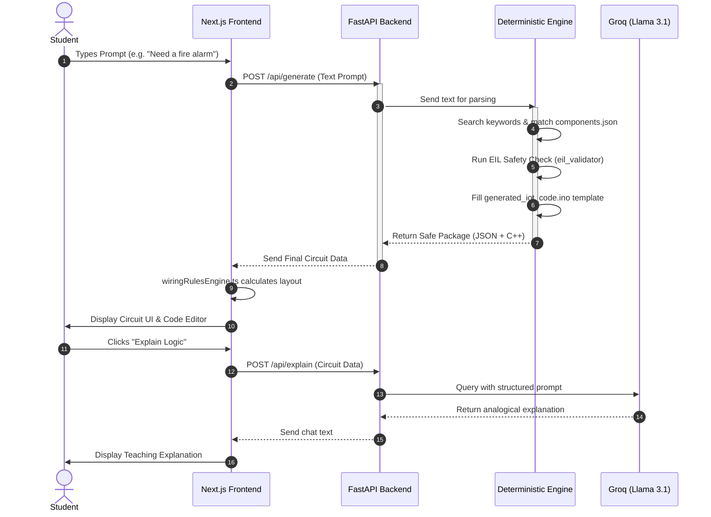

# Circuit Mentor: Comprehensive Team Analysis & Onboarding Guide

Welcome to the **Circuit Mentor** project! This document is designed for developers, teammates, and friends who want to understand exactly how Circuit Mentor works under the hood. It breaks down the full architectural diagram, defines key terms, and explains what every major file in the project does in relation to the main flow.

---

## 1. Introduction: What is Circuit Mentor?

### External View (What the User Sees)
Circuit Mentor is an AI-enhanced electronics learning platform. A student types a plain English idea (like *"I want an automatic plant waterer"*), and the platform instantly provides a visual circuit diagram (wiring), the exact C++ code needed to run it, and an AI chat assistant that explains the logic behind the circuit like a human teacher.

### Internal View (The Core Engineering Pivot)
Initially, the system tried to use AI (Large Language Models) to guess how to wire the circuit. This failed because AI hallucinates hardware logic, causing fake wiring or shorts. 

**Our Solution:** We separated the logic. The **circuit wiring and code generation is now 100% Deterministic (Hardcoded & Local)** ensuring 100% safe, instant circuits. The **AI is only used for text-based teaching** *after* the safe circuit is built.

---

## 2. Key Terminology Explained

If you are new to web development or this stack, here are the terms we use:

*   **Next.js / React (Frontend):** The framework used to build our user interface. React lets us build reusable components (like canvases). Next.js gives React routing superpowers.
*   **FastAPI / Python (Backend):** The server that does the heavy lifting. Fastest way to serve Python endpoints.
*   **Deterministic Engine:** A system that follows strict, hardcoded rules (Input A *always* equals Output B). This is the opposite of an AI LLM which might hallucinate.
*   **Zustand:** A lightweight state-management library for React. It acts as a "global brain" for the frontend.
*   **ReactFlow:** A library we use in the frontend to physically draw the draggable nodes (sensor icons) and bezier curves (the wires).

---

## 3. High-Level Architectural Diagram

Below is the complete architectural map showing how files connect during a single user request. **The file explanations in Section 4 map directly to these nodes.**

```mermaid
graph TD
    %% User Action
    User([1. User Prompt: 'Make a fire alarm'])
    
    %% Frontend Block
    subgraph Frontend [Next.js Frontend]
        Page(page.tsx)
        Layout(ResultWorkspaceLayout.tsx)
        WREngine(wiringRulesEngine.ts)
    end
    
    %% Backend Block
    subgraph Backend [FastAPI Backend]
        Main(main.py Gateway)
        
        subgraph Deterministic Engine
            LCEngine(local_circuit_engine.py)
            EIL(eil_validator.py)
            JSONDb[(components.json)]
            CodeTpl[generated_iot_code.ino]
        end
        
        LLM(groq_llm.py)
    end

    %% External
    GroqAPI((Groq AI - Llama 3.1))

    %% Flow Lines
    User -->|Input| Page
    Page -->|POST /api/generate| Main
    
    Main -->|Routes Request| LCEngine
    LCEngine -->|2. Reads Rules| JSONDb
    LCEngine <-->|3. Verifies Safety| EIL
    LCEngine -->|4. Fills Template| CodeTpl
    
    CodeTpl -->|Returns JSON & C++ Package| Main
    Main -->|JSON Payload| Layout
    
    Layout -->|Passes Data| WREngine
    WREngine -->|5. Draws visually using ReactFlow| Layout
    
    %% AI Flow Lines
    Layout -.->|6. User Clicks 'Explain'| Main
    Main -.->|Request| LLM
    LLM <.-.>|API Call| GroqAPI
    LLM -.->|Returns Teacher Text| Layout
```

---

## 3.5 System Workflow Diagram (Sequence of Events)

This sequence diagram illustrates the exact order of operations over time, from the moment a user submits a prompt to the final AI explanation.



---

## 4. File-by-File Working Analysis

Based on the diagram above, here is exactly what each file does as data flows through the system.

### 💻 Step A: The Frontend Entry Point
*   **`src/app/page.tsx`**: This is the starting point. It houses the input bar where the user types their prompt. When they hit Enter, this file packages the text and passes it to the Backend.
*   **`src/components/ResultWorkspaceLayout.tsx`**: The main dashboard. It waits for the backend to reply. Once the circuit payload arrives, this layout splits the screen: showing the Code on one side, and passing the wiring data to the Rules Engine to display the circuit on the other side.

### ⚙️ Step B: The Backend Heavy-Lifting (`main.py` Gateway)
*   **`backend/main.py`**: The traffic controller. When it catches the prompt from `page.tsx`, it directs the traffic. For a new circuit, it sends the string to the Deterministic Engine. When explanations are needed, it routes to `groq_llm.py`.

### 🧠 Step C: The Deterministic Engine (Circuit Mapping)
*   **`backend/local_circuit_engine.py`**: The brain of the operation. It scans the raw user text for keywords (e.g., "buzzer"). Instead of using AI, it uses hard logic to determine what hardware is needed and assigns safe Arduino pins to them (e.g., matching the buzzer to Pin 8).
*   **`backend/components.json`**: The knowledge base. `local_circuit_engine.py` reads this JSON database to understand physical limits. Because we hand-coded the voltage limits and pin types (Analog vs. PWM) here, the Engine never makes a hardware mistake.
*   **`backend/eil_validator.py`**: The Electronic Intelligence Layer (EIL). It acts as a safety firewall. Before the Engine finishes building the circuit, it checks with the EIL to ensure no components will short circuit or draw too much power.
*   **`backend/generated_iot_code.ino`**: The Engine finishes by opening this blank master C++ template, filling in the blanks with the exact pins it just assigned, and exporting the final working Arduino `.ino` code. 

*At this point, the backend sends the Code and the Components list back to the Frontend's `ResultWorkspaceLayout.tsx`.*

### 🎨 Step D: Visualizing the Canvas
*   **`frontend/src/logic/wiringRulesEngine.ts`**: The Layout waits for this file. It acts as an auto-router. It takes the raw list of JSON components sent by the backend and converts them into physical `(X, Y)` screen coordinates. It draws the connections (ReactFlow edges) between the components. It also automatically injects missed safety parts visually—like drawing a 220Ω resistor whenever it sees an LED.

### 🤖 Step E: AI Teacher (The Optional Last Step)
*   **`backend/groq_llm.py`**: If the user clicks the "Code & Logic Explanation" tab inside the `ResultWorkspaceLayout`, the layout signals the backend again. This file catches the signal, wraps the current circuit details into a strictly formatted prompt, and securely pings the **Groq API / Llama 3.1 LLM**. It returns natural language teaching analogies back to the student, completing the learning experience.

---

## 5. How to Run Circuit Mentor Locally

Because Circuit Mentor has a distinct frontend and backend, you must run **two servers** to test it fully.

**Terminal 1 (Backend):**
```bash
cd backend
python main.py
# (Or using uvicorn directly: uvicorn main:app --reload)
# Runs on localhost:8000
```

**Terminal 2 (Frontend):**
```bash
cd frontend
npm run dev
# Runs on localhost:3000
```

*Open your browser to `http://localhost:3000` to start building circuits!*
