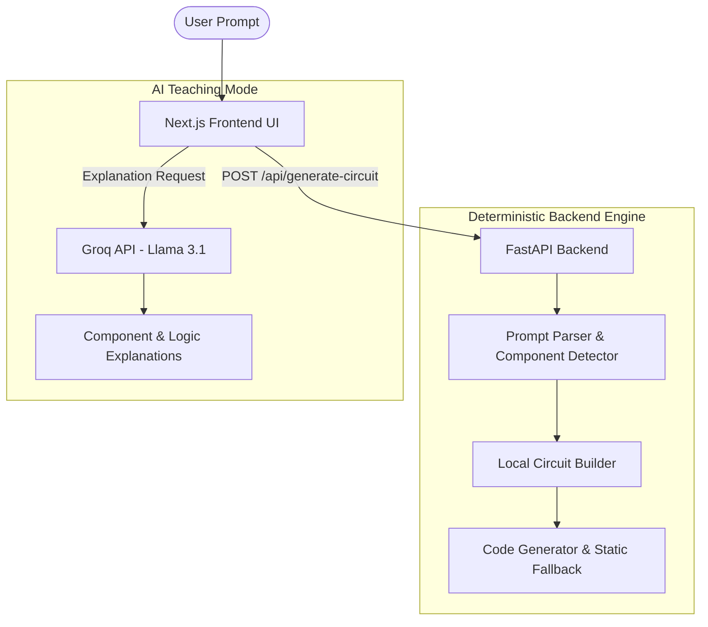

# CircuitMentor Technical Presentation
## "From Abstract Ideas to Safe, Working Circuits Instantly"

This document provides a slide-by-slide outline and speaker notes for a highly technical presentation of the CircuitMentor architecture. It is designed to be presented to Engineering HODs, technical judges, or development teams.

---

### Slide 1: Introduction & Problem Statement
**Visual:** Two contrasting metrics on screen: "LLM Hallucinations in Circuit Design (High)" vs. "Student Safety & Success Rate (Low)". A frustrated student looking at an invalid AI-generated circuit, next to a burning component icon.

**Speaker Notes:**
> "Good morning. We are presenting CircuitMentor, an AI-enhanced electronics learning platform. 
> When we started building a tool to translate student prompts—like 'make a motion-activated alarm'—into physical circuits, we relied heavily on LLMs for netlist generation. We quickly hit a wall. Generative AI is probabilistic, but hardware is deterministic. The LLMs suffered from rate limits, unpredictable hallucinations like tying a 5V line direct to a GPIO pin, and latencies upwards of 20 seconds. 
> We realized we couldn't teach hardware with probabilistic wiring. We needed a new architecture."

---

### Slide 2: The Core Pivot (The "Aha!" Moment)
**Visual:** Before and After flowcharts. 
*Before:* `User Prompt -> LLM -> Unpredictable Circuit`
*After:* `User Prompt -> Deterministic Engine -> Safe Circuit -> LLM for Explanation`

**Speaker Notes:**
> "Our solution was a complete architectural pivot. We completely removed the AI from the critical path of circuit generation. 
> Today, our circuit generation is 100% deterministic, offline, and instant. We reduced generation time from 20 seconds to less than 10 milliseconds. 
> We now strictly reserve our AI—specifically Llama-3.1 via the Groq API—for what it does best: teaching, explaining code, and generating non-robotic, relatable analogies for students, long after the safe circuit has already been guaranteed."

---

### Slide 3: High-Level System Architecture
**Visual:** The Mermaid Architecture Diagram showing Next.js rendering, FastAPI Backend, deterministic engine bypassed, and the AI Teacher route.

**Speaker Notes:**
> "Here is our current stack. We utilize a React/Next.js frontend coupled with a Python FastAPI backend.
> When a user submits a prompt, it bypasses external APIs entirely. The FastAPI backend routes it to our Local Circuit Engine, which parses keywords, maps components, and generates the layout and universal C++ firmware instantly. 
> Only when a student requests a 'Logic Explanation' does the frontend make a secure, asynchronous call to the Groq API to retrieve AI-generated educational content."

---

### Slide 4: The Deterministic Backend Engine & EIL
**Visual:** Code snippet of `local_circuit_engine.py` highlighting keyword mapping alongside `components.json` showing strict voltage/current rules.

**Speaker Notes:**
> "Let's look under the hood at the generation block. Instead of asking an LLM to guess pin layouts, our engine uses advanced NLP tokenization and keyword mapping against a strict `components.json` registry. 
> A critical safeguard we built is the EIL—the Electronics Intelligence Layer. This is a rule-based validator that prevents shorts, floating pins, and power drains. Because our local engine pre-validates pin assignments against this layer directly, we guarantee 100% safe, predictable pin assignments—like mapping a Soil Sensor to A2 and a Buzzer to Pin 8—with zero chance of hallucinations."

---

### Slide 5: Frontend Visual Routing & Safety Injectors
**Visual:** A screenshot or short GIF of the ReactFlow circuit canvas instantly automatically routing wires and inserting a resistor in front of an LED.

**Speaker Notes:**
> "On the frontend, receiving the valid component payload triggers our `wiringRulesEngine.ts`. This acts as an auto-router. 
> But it does more than draw lines. It features active 'Safety Injectors.' For instance, if the backend payload includes an LED, the rules engine automatically detects the missing current-limiting hardware and visually spaces out and connects a 220Ω resistor in series. If it detects a relay, it injects a flyback diode. It also dynamically builds a virtual breadboard with distinct 5V and GND bus rails to keep the visualization clean and easy to follow."

---

### Slide 6: Continuous Firmware Delivery
**Visual:** A side-by-side of an Arduino Uno graphic and the generated C++ IoT code. 

**Speaker Notes:**
> "Because the hardware is securely determined, the software becomes trivial. The backend engine compiles a rock-solid, previously tested C++ template—`generated_iot_code.ino`. 
> This firmware features non-blocking logic (using `millis()` instead of `delay()`) and unified abstractions for over 30 different sensors and actuators. The code works perfectly inline with the exact pins that were just deterministically assigned."

---

### Slide 7: Business & Performance ROI
**Visual:** 4 large metrics: 
1. **< 10ms Latency** (Instant) 
2. **100% Offline Generation Capability** 
3. **Zero Hallucinated Shorts** 
4. **$0.00** API Cost per Circuit Gen

**Speaker Notes:**
> "Let's conclude with why this architecture wins from a technical and business perspective. 
> By extracting LLMs from the generation pipeline, we killed the latency issue—dropping from 20 seconds to sub-0.1 seconds. 
> We eliminate external dependency failures: circuit design works perfectly offline. Groq's API limits are no longer a bottleneck.
> We achieved 100% safe wiring, something generative AI simply cannot guarantee.
> Finally, this drops our compute and API costs to essentially zero for core operations, allowing us to allocate resources toward scaling the AI teaching assistant features instead. 
> CircuitMentor is now a scalable, safe, and instant sandbox for engineering education."

---
### **Q&A Technical Preparedness Details**

*(Keep these in your back pocket for technical questions)*

*   **Q: How do you handle complex prompts if it's purely keyword-based?**
    *   *A: We utilize lightweight fuzzy matching for component terms. For logic, the system defaults to the safest baseline behavior (e.g., IF sensor triggers, THEN actuator turns on) built into our C++ template. For highly complex logic, we prompt the user in the Next.js UI to tweak the rules manually, empowering them to learn rather than creating a black box.*
*   **Q: Why Groq/Llama-3 over OpenAI?**
    *   *A: Groq's LPU architecture provides Llama-3.1-8b at 'instant' speeds, allowing the explanations to load just as fast as the local circuit generation without the heavier latency and cost associated with standard GPT-4 REST calls.*
